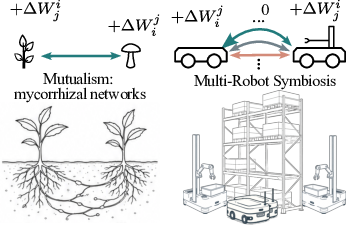
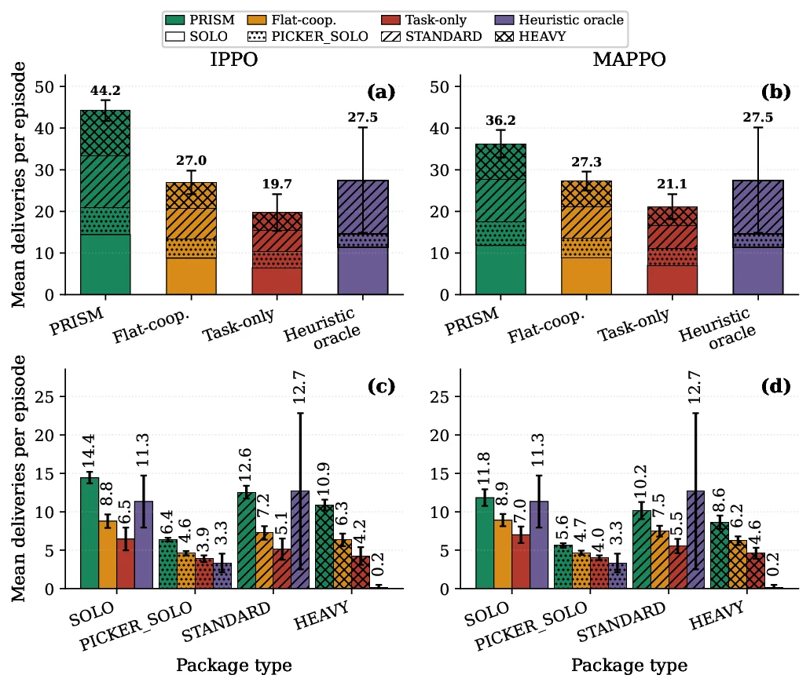
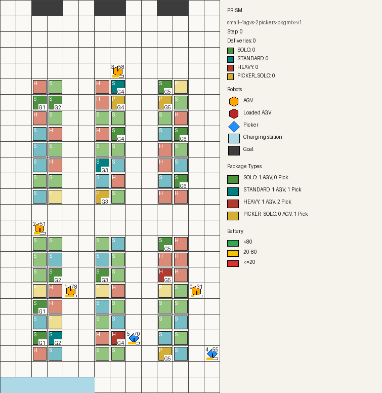

# PRISM: Policy-shaping via Reward Decomposition for Inter-agent Symbiosis

This repository contains source code and compact evaluation artifacts to support
our paper *"PRISM: Policy-shaping via Reward Decomposition for Inter-agent
Symbiosis in Multi-Robot Cooperation"*.

The project studies heterogeneous warehouse teams composed of AGV and picker
agents, and evaluates whether reward decomposition can make cooperative
multi-agent reinforcement learning produce stronger mutualistic behavior.

## Abstract

Heterogeneous multi-robot systems often require agents with different roles,
capabilities, and resource constraints to coordinate around shared tasks. In
warehouse automation, AGVs, pickers, package types, charging needs, and partial
observability create coordination failures that are not captured by purely
individual or purely team-level reward signals.

PRISM introduces a symbiotic reward-shaping framework that decomposes task
performance into relationship-aware components. The method measures and shapes
inter-agent outcomes such as mutualism, commensalism, parasitism, and
competition, then applies those signals inside IPPO and MAPPO training. In the
packaged heterogeneous TA-RWARE experiments, PRISM improves delivery throughput,
supports harder package types, and produces stronger mutualism proxies than
flat-cooperative and task-only reward baselines.

## Key idea

**We import *symbiosis* — the ecological theory of how unlike organisms live
together — directly into the reward function of a multi-robot team.** Biology
has long distinguished the ways two different species can interact: *mutualism*
(both benefit), *commensalism* (one benefits, the other is unaffected),
*parasitism* (one benefits at the other's expense), and *competition* (both are
harmed). PRISM is, to our knowledge, the first framework to make these
relationship types *first-class, measurable, and directly optimizable* quantities
in cooperative multi-agent reinforcement learning.

<p align="center">
  
</p>

The novelty is a shift in what reward is *about*. Conventional designs reward
agents for *what they do* — either each robot in isolation (task-only) or the
team as one undifferentiated lump (flat-cooperative). Both are blind to *how a
robot's actions land on its teammates*: a picker can look productive while
quietly starving the AGVs of battery, or block a lane while its own counter
climbs. PRISM instead rewards agents for *the relationship their actions create*.
It decomposes team performance into per-pair, role-aware relationship terms,
estimates online whether each interaction is mutualistic, commensal, parasitic,
or competitive, and folds those signals back into the gradient — so the policy is
pulled toward partnerships that pay off for *both* sides, not just toward higher
personal output.

Crucially, this is a **reward shaping, not a new algorithm.** Symbiosis is
encoded entirely in the reward decomposition, leaving the policy-gradient backend
untouched: PRISM drops into standard IPPO and MAPPO without changes to the network,
optimizer, or training loop. That makes the contribution portable across cooperative
MARL methods rather than tied to one architecture.

**And it boosts.** Naming and rewarding the relationship — rather than only the
task — lifts throughput to **40.2 deliveries per episode** averaged across the
IPPO and MAPPO backbones, a **+48.3%** gain over the flat-cooperative bonus,
**+97.1%** over task-only reward, and **+46.2%** over a strong rule-based
heuristic oracle. Critically, PRISM is the *only* learned condition that
significantly exceeds the heuristic: the flat-cooperative bonus merely ties it
(−1.5%, n.s.) and task-only falls below it (−25.8%). The gain concentrates
exactly where coordination is structurally required — the three-agent
(1 AGV + 2 Picker) cooperative requests, where PRISM completes ~10 deliveries
per episode against the heuristic's near-zero — and is driven by adaptable
cross-role coupling, not reward density or rigid role-locking. The ecological
signal is not just interpretable bookkeeping; it is the thing that drives the
gain.

|  | Task-only | Flat-cooperative | PRISM (symbiotic) |
|:--|:--|:--|:--|
| **What the reward is *about*** | each robot's own output | one lumped team score | the relationship each action creates |
| **Sees how an action lands on teammates** | ✗ | ✗ | ✓ — per-pair, role-aware |
| **Distinguishes mutualism / commensalism / parasitism / competition** | ✗ | ✗ | ✓ — estimated online |
| **Deliveries / episode** (IPPO) | 19.7 ± 6.8 | 27.0 ± 4.3 | **44.2 ± 3.8** |
| **Deliveries / episode** (MAPPO) | 21.1 ± 4.6 | 27.3 ± 3.5 | **36.2 ± 5.0** |
| **Gain vs. rule-based heuristic** (avg.) | −25.8% (n.s.) | −1.5% (n.s.) | **+46.2%** |

## Setup

Install the package in editable mode:

```bash
pip install -e .
```

The package requires Python 3.9 or newer. Core dependencies are listed in
`pyproject.toml` and include Gymnasium, PyTorch, SKRL, NumPy, pandas,
matplotlib, seaborn, TensorBoard, Pillow, and imageio.

## Heterogeneous PRISM Training

The main experiment compares PRISM against flat-cooperative and task-only
reward conditions in a battery-aware heterogeneous warehouse with four AGVs and
two pickers.

```bash
python experiments/run_heterogeneous.py --config configs/heterogeneous.yaml
```

### Results:

PRISM achieves the highest throughput among all reward conditions. The table
below breaks deliveries down by package type (full-training summary in
`runs/results/c3_full_training_pkg_breakdown.json`; mean deliveries per
evaluation episode ± 95% CI). The decisive separation appears in the cooperative
package types — STANDARD (1 AGV + 1 Picker) and especially HEAVY
(1 AGV + 2 Pickers) — that require genuine cross-role coordination, while PRISM
stays competitive on the single-role SOLO and PICKER_SOLO work.

| Backend | Reward condition | Total deliveries | SOLO | PICKER_SOLO | STANDARD | HEAVY |
|:--|:--|--:|--:|--:|--:|--:|
| IPPO | **PRISM** | **44.23 +/- 2.50** | 14.43 | 6.38 | 12.55 | 10.86 |
| IPPO | Flat-cooperative | 26.96 +/- 2.82 | 8.77 | 4.61 | 7.25 | 6.33 |
| IPPO | Task-only | 19.72 +/- 4.42 | 6.46 | 3.89 | 5.13 | 4.24 |
| MAPPO | **PRISM** | **36.24 +/- 3.29** | 11.83 | 5.61 | 10.16 | 8.63 |
| MAPPO | Flat-cooperative | 27.28 +/- 2.27 | 8.92 | 4.66 | 7.48 | 6.23 |
| MAPPO | Task-only | 21.14 +/- 3.00 | 7.00 | 4.01 | 5.53 | 4.60 |



## Example Evaluation Rollout

PRISM IPPO evaluation rollout in the heterogeneous warehouse setting. The
compact artifact package includes learned-policy and heuristic rollouts for
qualitative inspection.

<p align="center">
  
  <br />
  <strong>PRISM IPPO, 81 deliveries</strong>
</p>

## Repository Structure

- `tarware/`: heterogeneous TA-RWARE environment, package dynamics, battery
  coupling, rendering, heuristics, and role assignment.
- `experiments/run_heterogeneous.py`: PRISM, flat-cooperative, and task-only
  training entry point.
- `experiments/run_heuristic_baseline.py`: rule-based baseline runner.
- `experiments/symbiosis_shaping.py`: relationship-aware reward shaping.
- `configs/`: experiment configurations.
- `runs/results/`: compact result summaries used by the tables above.
- `assets/figures/`: paper figures and web-optimized figure assets.
- `assets/eval_gifs/`: rendered evaluation rollouts.

## Citation

```bibtex
@article{niu2026prism,
  title   = {PRISM: Policy-shaping via Reward decomposition for Inter-agent Symbiosis in Multi-Robot Cooperation},
  author  = {Niu, Xuezhi and Broo, Didem Gurdur},
  journal = {xxxxx},
  year    = {2026}
}
```
