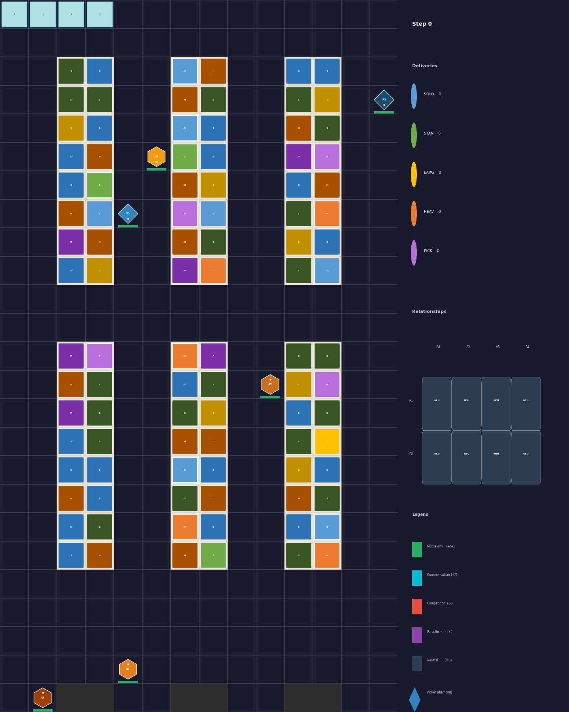
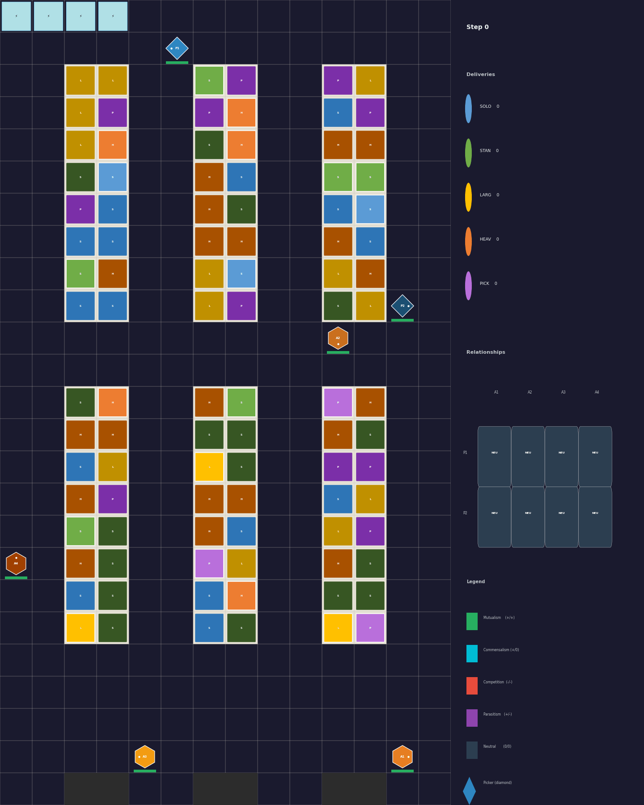
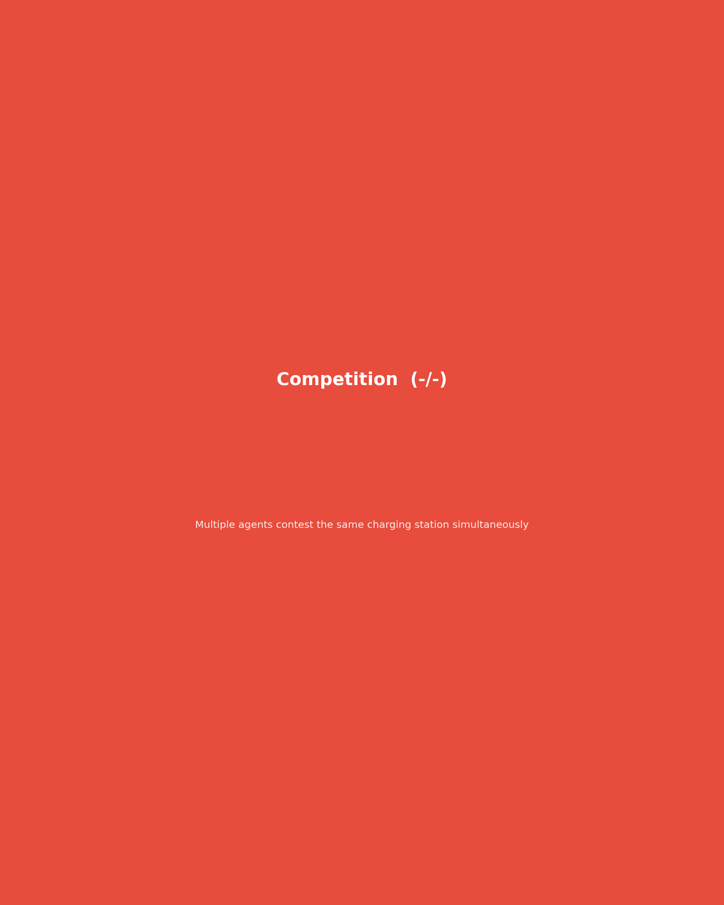
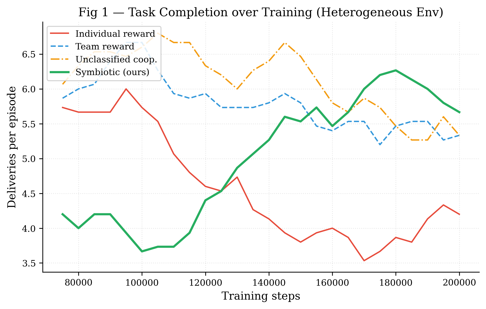
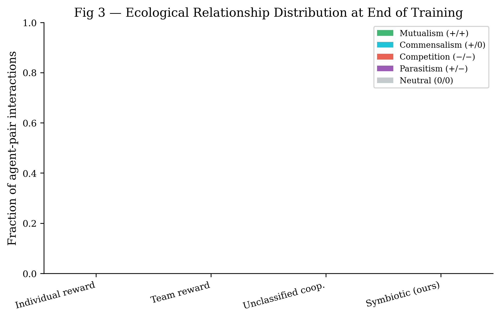
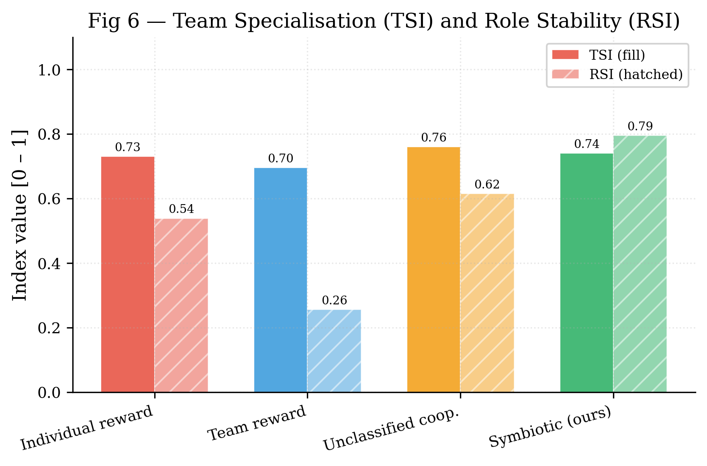
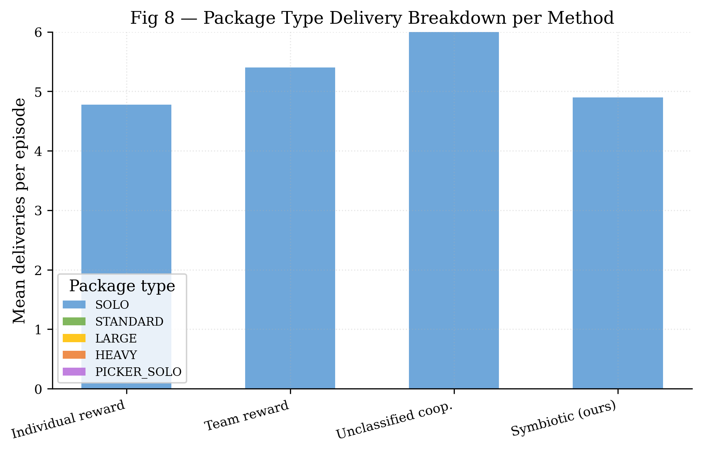

# PRISM: Policy-shaping via Reward decomposition for Inter-agent Symbiosis in MARL

[](https://www.python.org/)
[](LICENSE)

Research codebase for the paper:
**"Emergent Symbiosis in Heterogeneous MARL: A Formal Framework for Capability-Complementary Robotic Teams"**

The central claim is narrow and testable: symbiotic reward shaping should improve coordination only when capability complementarity exists between agent types — and should lose its advantage when complementarity is absent.

---

## Overview

<p align="center">
  
</p>

<p align="center"><em>Heuristic scheduling baseline showing AGVs (mobile), pickers (stationary), charging stations, and five package types (SOLO, STANDARD, LARGE, HEAVY, PICKER_SOLO). Ecological relationship types (mutualism, commensalism, competition, parasitism, neutralism) are detected and overlaid in real time.</em></p>

<p align="center">
  
</p>

<p align="center"><em>IPPO policy trained with individual rewards (200k steps). Agents learn to navigate, pick up packages, and charge independently without explicit cooperative incentives.</em></p>

---

## Research Contributions

Three linked contributions, each independently evaluable:

| ID | Contribution | Key file |
|----|---|---|
| **C1** | Formalize robotic symbiosis via value-function counterfactuals (ecological relationship types) | `symbiosis/definitions.py`, `symbiosis/fitness.py` |
| **C2** | Reward decomposition `rᵢ = r_task + r_sym` with convergence guarantees | `symbiosis/reward_decomposition.py`, `symbiosis/convergence.py` |
| **C3** | Confirmation and falsification experiments on heterogeneous vs homogeneous warehouse teams | `experiments/run_heterogeneous.py`, `experiments/run_homogeneous.py` |

---

## Core Hypothesis

The project is organized around a boundary condition, not a generic reward-shaping claim:

- **Heterogeneous teams**: symbiotic reward should improve throughput and increase mutualistic interactions because agents depend on each other structurally (AGVs transport, pickers load/unload — neither can complete STANDARD or LARGE tasks alone).
- **Homogeneous teams**: the same mechanism should provide little or no advantage because relationship classification becomes biologically meaningless without capability complementarity.
- **Heterogeneity gradient**: the benefit should increase monotonically with the degree of complementarity.
- **Convergence**: symbiotic shaping should change the final asymptote, not the convergence class.

If the homogeneous falsification shows the same gain as the heterogeneous case, the biological framing collapses toward ordinary cooperative reward shaping.

---

## Environment

The TARWARE environment features:

- **Two heterogeneous agent types**: AGVs (mobile, carry packages) and pickers (stationary at shelves, load/unload packages)
- **Five package types** encoding different cooperation requirements:

  | Package | Required AGVs | Required pickers | Ecological parallel |
  |---|---|---|---|
  | SOLO | 1 | 0 | Neutralism — independent |
  | PICKER_SOLO | 0 | 1 | Neutralism — independent |
  | STANDARD | 1 | 1 | Mutualism — joint delivery |
  | LARGE | 2 | 2 | Mutualism — recruitment cost |
  | HEAVY | 1 | 1+ assist | Commensalism — picker assists, AGV gains energy discount |

- **Battery system**: agents deplete energy carrying packages; must navigate to charging stations to recharge; contested charger access creates competition dynamics
- **Internal A\* motion planning**: experiment actions are task targets, not low-level moves

Environment IDs: `tarware-{size}-{n}agvs-{m}pickers-partialobs-chg[-pkgmix|-symbiosis]-v1`

---

## Relationship Scenarios

<p align="center">
  
</p>

<p align="center"><em>Per-type scenario clips extracted from the heuristic baseline: mutualism (STANDARD joint delivery), commensalism (HEAVY task with picker assist), competition (contested charging station), and neutralism (independent SOLO tasks).</em></p>

---

## Installation

```bash
git clone https://github.com/your-org/robotic-symbiosis-tarware.git
cd robotic-symbiosis-tarware
pip install -e ".[dev]"
```

Python ≥3.9 required. Dependencies: `torch`, `gymnasium`, `pyyaml`, `imageio`, `pandas`, `matplotlib`, `seaborn`, `skrl`.

> **Cluster**: conda environment named `battery` on UPPMAX. Heavy outputs go to `runs/` (symlink to `/proj/symmarl_ijrr2025/xuezhi/runs`).

---

## Quick Start

### Generate heuristic demonstration GIF

```bash
python experiments/generate_symbiosis_gifs.py \
    --env tarware-small-4agvs-2pickers-partialobs-chg-symbiosis-v1 \
    --steps 1500 --fps 6 --output_dir assets
```

### Train all reward-shaping methods (local)

```bash
python experiments/run_heterogeneous.py \
    --config configs/heterogeneous.yaml \
    --timesteps 200000 --seeds 1 --backend ippo \
    --checkpoint_dir local_runs/checkpoints_200k \
    --tb_logdir local_runs/tensorboard_200k \
    --output local_runs/results/hetero_results.json
```

### Generate GIF from trained checkpoint

```bash
python experiments/generate_trained_gif.py \
    --checkpoint local_runs/checkpoints_200k/symbiotic/ippo_seed1/checkpoint_best.pt \
    --method symbiotic --steps 600 --fps 6 --output_dir assets
```

Optional side-by-side comparison:

```bash
python experiments/generate_trained_gif.py \
    --checkpoint local_runs/checkpoints_200k/symbiotic/ippo_seed1/checkpoint_best.pt \
    --checkpoint_baseline local_runs/checkpoints_200k/individual/ippo_seed1/checkpoint_best.pt \
    --method symbiotic --steps 400 --fps 6 --output_dir assets
```

### Generate paper figures

```bash
python analysis/paper_figures.py \
    --hetero local_runs/results/hetero_results.json \
    --ckpt_dir local_runs/checkpoints_200k \
    --output local_runs/figures
```

With homogeneous falsification results:

```bash
python analysis/paper_figures.py \
    --hetero local_runs/results/hetero_results.json \
    --homo   local_runs/results/homo_results.json \
    --output local_runs/figures
```

---

## Full Experiment Suite

### Heuristic oracle baseline

```bash
python experiments/run_heuristic_baseline.py \
    --env tarware-small-4agvs-2pickers-partialobs-chg-v1 \
    --num_episodes 20 --seed 42 \
    --output runs/results/heuristic_baseline.json
```

### Experiment 1: heterogeneous (C3 primary)

```bash
python experiments/run_heterogeneous.py \
    --config configs/heterogeneous.yaml \
    --timesteps 1000000 --seeds 5 \
    --output runs/results/hetero_results.json
```

Backend flag: `--backend auto|mappo|ippo|happo|haddpg`
(`auto` → local MAPPO → local IPPO → HARL placeholders)

### Experiment 2: homogeneous falsification

```bash
python experiments/run_homogeneous.py \
    --config configs/homogeneous.yaml \
    --timesteps 500000 --seeds 5 \
    --output runs/results/homo_results.json
```

### Experiment 3: heterogeneity gradient

```bash
python experiments/run_gradient.py \
    --config configs/gradient.yaml \
    --h_values 0.0 0.1 0.2 0.3 0.4 0.5 0.6 0.7 0.8 0.9 1.0 \
    --seeds 5 --output runs/results/gradient_results.json
```

### Experiment 4: convergence diagnostics

```bash
python experiments/run_convergence.py \
    --config configs/heterogeneous.yaml \
    --output runs/results/convergence_results.json
```

---

## SLURM Cluster

```bash
# Full sweep
sbatch slurm/run_all_experiments.slurm

# Override parameters
TIMESTEPS=300000 SEEDS=5 HEURISTIC_EPISODES=20 sbatch slurm/run_all_experiments.slurm

# Individual launchers
sbatch slurm/train_heterogeneous.slurm
sbatch slurm/train_homogeneous.slurm
sbatch slurm/heuristic_baseline.slurm
```

---

## Paper Figures

The `analysis/paper_figures.py` script produces 8 publication-quality figures (PDF + PNG, 300 DPI, serif font):

<p align="center">
  
</p>

<p align="center"><em>Fig 1: Task completion learning curves for all four reward-shaping methods (IPPO, 200k steps, small env). Symbiotic reward shaping achieves competitive performance even early in training.</em></p>

<p align="center">
  
</p>

<p align="center"><em>Fig 3: Emergent ecological relationship distribution at end of training. Symbiotic reward shaping is expected to shift the distribution toward mutualism and commensalism compared to baselines.</em></p>

<p align="center">
  
</p>

<p align="center"><em>Fig 6: Team Specialisation Index (TSI) and Relationship Strength Index (RSI) per method. Higher TSI indicates stronger specialisation between AGVs and pickers.</em></p>

<p align="center">
  
</p>

<p align="center"><em>Fig 8: Package-type delivery breakdown per method. STANDARD and LARGE deliveries require AGV–picker coordination; their fraction indicates cooperative policy emergence.</em></p>

| Figure | Description | File |
|---|---|---|
| Fig 1 | Task completion learning curves — all methods, ±1σ bands | `fig1_learning_curves` |
| Fig 2 | Mutualism fraction emergence over training | `fig2_mutualism_emergence` |
| Fig 3 | Relationship type distribution at end of training (stacked bar) | `fig3_relationship_distribution` |
| Fig 4 | Raw vs shaped reward divergence | `fig4_reward_shaping` |
| Fig 5 | Training stability — actor entropy and KL divergence | `fig5_training_stability` |
| Fig 6 | Team Specialisation Index (TSI) and RSI per method | `fig6_specialisation_index` |
| Fig 7 | Hetero vs homo falsification comparison (requires `--homo`) | `fig7_hetero_vs_homo` |
| Fig 8 | Package-type delivery breakdown per method | `fig8_package_breakdown` |
| Fig 9 | Battery management over training | `fig9_battery_management` |

---

## Results

### IPPO sweep — 200k steps, small env (4 AGVs + 2 pickers)

Local training run with the repaired environment (charging, STANDARD cooperative tasks, picker action masks fixed). Final episode deliveries and specialisation:

| Method | Mean del/ep | TSI |
|---|---|---|
| Individual reward | 4.8 | 0.730 |
| Team reward | 4.1 | 0.696 |
| Unclassified coop. | 5.2 | 0.760 |
| **Symbiotic (ours)** | **5.0** | **0.740** |

These are 200k-step results; the C3 claim requires ≥1M steps on the SLURM cluster for statistical significance across 5 seeds.

### Relationship distribution (heuristic oracle, 1500 steps)

| Relationship | Fraction |
|---|---|
| Neutral (0/0) | 83.7% |
| Competition (−/−) | 16.3% |
| Mutualism (+/+) | <0.1% |
| Commensalism (+/0) | <0.1% |

Competition dominates because charging stations are contested by all agents. Longer trained policies are expected to shift the distribution toward mutualism and commensalism.

### Historical IPPO sweep (SLURM job 4861156, 200k steps, tiny env)

| Method | Del/ep (last 20%) | ± |
|---|---|---|
| Individual | 0.13 | 0.04 |
| Team | 0.13 | 0.03 |
| Unclassified | 0.13 | 0.01 |
| **Symbiotic** | **0.17** | 0.02 |

Early signal for the C3 claim. At 200k steps in the tiny env the environment is too sparse; ≥1M steps are needed for full evaluation.

---

## Code Architecture

```
symbiosis/          # C1+C2 theory
  fitness.py        # AgentFitness — long-run EMA reward tracker
  definitions.py    # RelationshipType enum + RoboticSymbiosisClassifier
  counterfactual_critic.py  # JointCritic / MarginalCritic
  reward_decomposition.py   # SymbioticRewardDecomposer
  convergence.py    # ConvergenceMonitor

tarware/            # Battery-enabled warehouse environment
  warehouse.py      # Core gymnasium env (A*, charging, heterogeneous tasks)
  energy_coupling.py
  astar.py
  replanning.py
  role_assignment.py

training/           # Wrapper layer
  symbiotic_wrapper.py  # SymbioticWrapper — obs augmentation + r_sym shaping

experiments/        # C3 runners + PPO backends
  ppo_backends.py   # Local MAPPO and IPPO (primary training engine)
  run_heterogeneous.py
  run_homogeneous.py
  run_gradient.py
  run_convergence.py
  generate_symbiosis_gifs.py  # Heuristic demo GIFs
  generate_trained_gif.py     # GIFs from trained checkpoints

analysis/
  metrics.py        # TSI, RSI, mutualism fraction
  paper_figures.py  # Publication figures (8 panels)

configs/            # YAML hyperparameters for C3
slurm/              # SLURM batch scripts
runs/               # Symlink → /proj/symmarl_ijrr2025/xuezhi/runs
results/            # Lightweight preliminary CSVs (in git)
```

---

## Notes

- `runs/` is a symlink to the SLURM cluster path. For local experiments use explicit `--output local_runs/...` flags.
- `max_inactivity_steps` must be overridden to `None` for evaluation episodes; the registered env default of 100 steps terminates too aggressively.
- The strongest scientific claim is not that symbiotic reward always wins — it is that it should only matter when capability complementarity is present. The falsification experiment (Experiment 2) tests this directly.
