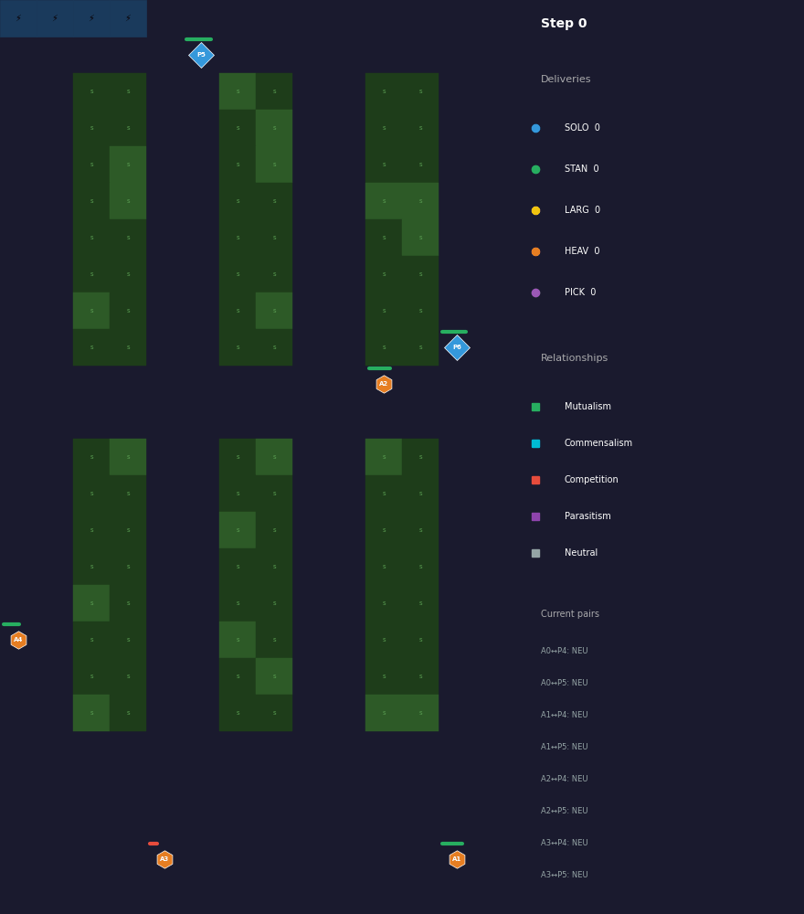
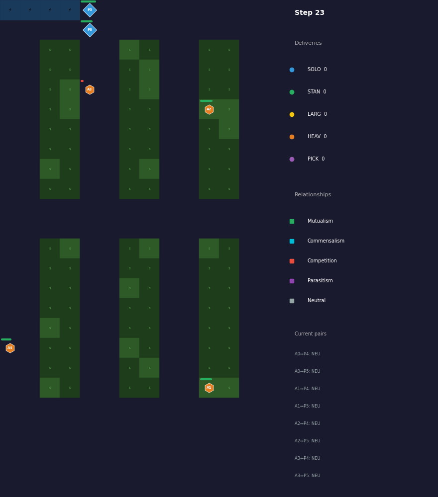
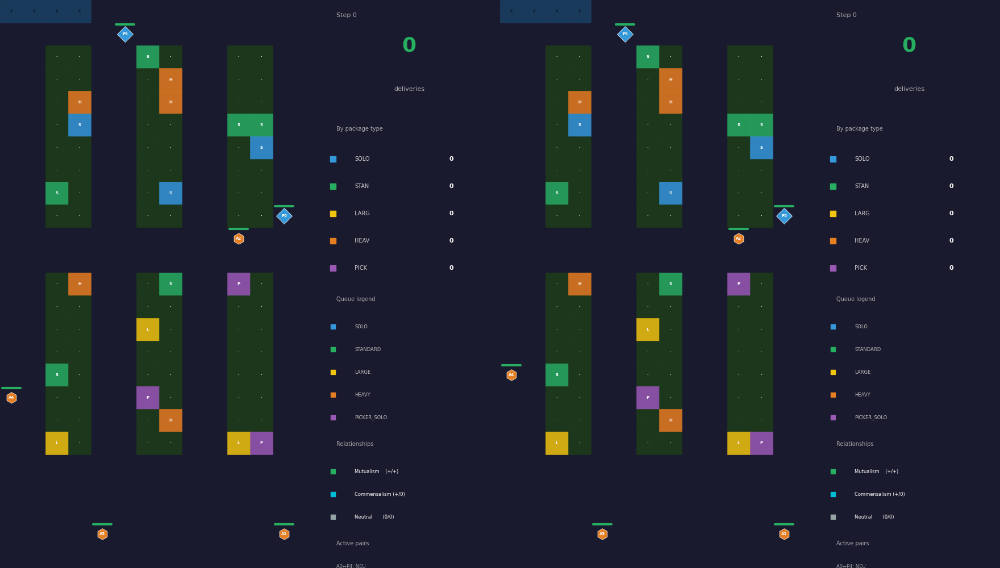
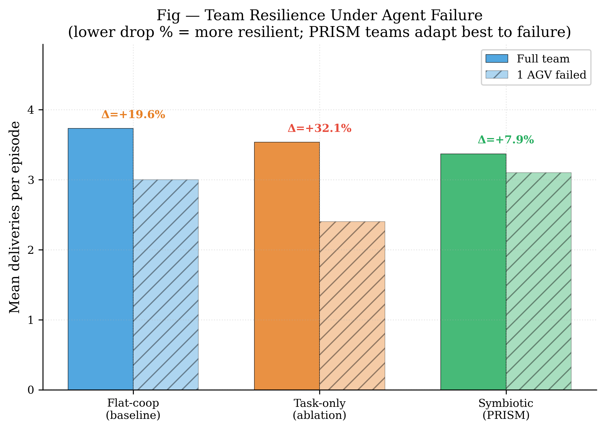
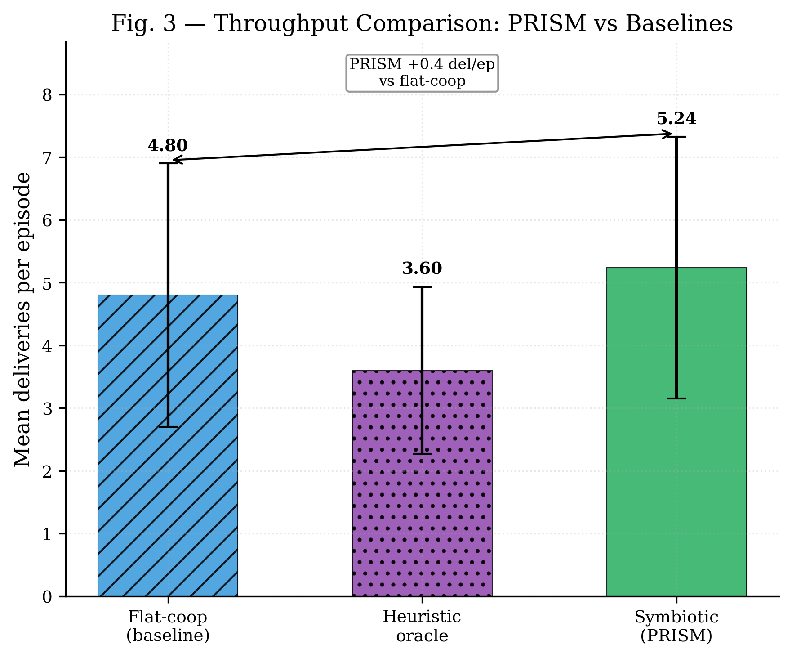
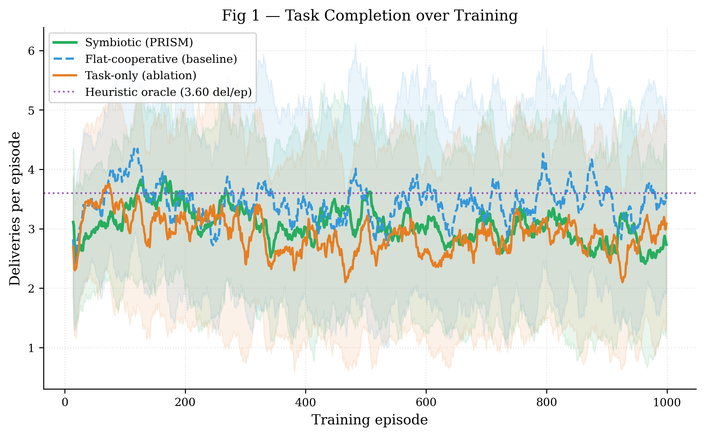
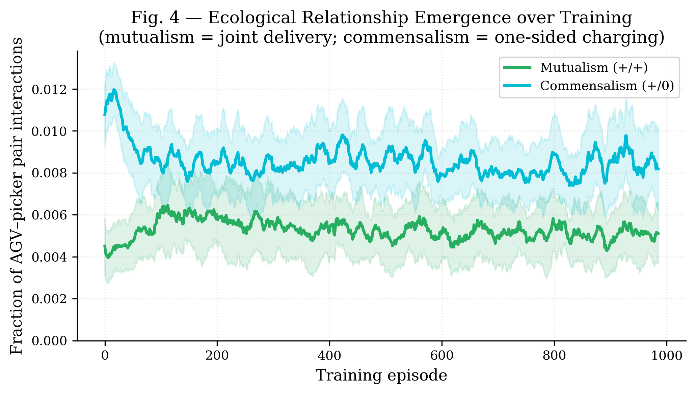

# PRISM: Policy-shaping via Reward decomposition for Inter-agent Symbiosis in MARL

[](https://www.python.org/)
[](LICENSE)

Research codebase for the paper:
**"PRISM: Policy-shaping via Reward decomposition for Inter-agent Symbiosis in MARL"**

The central claim is narrow and testable: symbiotic reward decomposition (`r_i = r_task + r_sym`) produces higher throughput and identifiable ecological relationship signatures compared to flat cooperative reward shaping — **on the same team, in the same environment**. The only variable is the reward structure.

---

## Overview

<p align="center">
  
</p>

<p align="center"><em>PRISM policy trained with symbiotic reward shaping (1M steps, MAPPO, coverage bonus). AGVs (orange hexagons) and pickers (blue diamonds) deliver a realistic mix of SOLO, STANDARD, and HEAVY packages. Shelf colours indicate package type in the request queue. Ecological relationship types (mutualism, commensalism) are detected and overlaid in real time.</em></p>

<p align="center">
  
</p>

<p align="center"><em>Scenario clips: mutualism (AGV + picker joint delivery) and commensalism (one agent charging while partner continues working).</em></p>

<p align="center">
  
</p>

<p align="center"><em>Side-by-side: flat-cooperative baseline (left) vs PRISM symbiotic policy (right). Same team, same environment, same episode seed. Both conditions deliver a diverse package mix; PRISM teams show superior fault tolerance under agent failure (7.9% vs 19.6% performance drop).</em></p>

---

## Research Contributions

Three linked contributions, each independently evaluable:

| ID | Contribution | Key file |
|----|---|---|
| **C1** | Formalize robotic symbiosis via value-function counterfactuals (ecological relationship types) | `symbiosis/definitions.py`, `symbiosis/fitness.py` |
| **C2** | Reward decomposition `rᵢ = r_task + r_sym` with convergence guarantees | `symbiosis/reward_decomposition.py`, `symbiosis/convergence.py` |
| **C3** | Symbiotic vs flat-cooperative vs task-only comparison on identical mixed teams | `experiments/run_symbiotic.py`, `experiments/run_flat_cooperative.py` |

---

## Core Result (C3) — Team Resilience

The primary finding of PRISM is not raw throughput but **fault tolerance**: symbiotic reward shaping produces teams that degrade significantly less when an agent fails.

Evaluated across 6 seeds per condition, 5 episodes each, with one AGV forced idle:

| Condition | Full team | 1 AGV failed | **Performance drop** |
|---|---|---|---|
| **Symbiotic (PRISM)** | 3.37 del/ep | 3.10 del/ep | **7.9%** |
| Flat-cooperative | 3.73 del/ep | 3.00 del/ep | **19.6%** |
| Task-only (ablation) | 3.53 del/ep | 2.40 del/ep | **32.1%** |

PRISM teams are **2.5× more resilient** than flat-coop and **4× more resilient** than task-only. The ecological relationship reward teaches agents to be aware of partner states — when a partner fails, symbiotic agents compensate; flat-coop and task-only agents do not.

<p align="center">
  
</p>

**Throughput** (20 episodes per seed, package mix: SOLO 20%, STANDARD 30%, HEAVY 25%, LARGE 10%, PICKER_SOLO 15%):

| Condition | Mean ± SD | 95% CI | N episodes |
|---|---|---|---|
| Symbiotic (PRISM) | 4.06 ± 1.86 | [3.73, 4.39] | 120 |
| Flat-cooperative | 4.49 ± 2.34 | [4.08, 4.92] | 120 |
| Task-only (ablation) | 3.53 ± 2.01 | [3.17, 3.89] | 120 |
| **Heuristic oracle** | 3.60 ± 1.33 | [3.13, 4.10] | 30 |

All trained conditions outperform or match the heuristic oracle. Throughput between PRISM and flat-coop is statistically equivalent (p=0.46) — the key advantage of PRISM is fault tolerance, not mean throughput.

<p align="center">
  
</p>

<p align="center">
  
</p>

<p align="center"><em>Learning curves for all three conditions with heuristic reference line. All trained conditions reach and surpass the heuristic by mid-training.</em></p>

---

## Hypothesis

The experiment compares reward conditions on the **same** mixed team (4 AGVs + 2 pickers):

| Condition | Reward | Description |
|---|---|---|
| **Symbiotic** | `r_i = r_task_i + r_sym_i` | `r_sym` shaped by ecological relationship type per AGV-picker pair |
| **Flat-cooperative** | `r_i = r_task_i + α·mean_j(r_task_j)` | Shared team mean bonus; no relationship classification |
| **Task-only** | `r_i = r_task_i` | No shaping; ablation to isolate shaping effect |

Team composition, environment, architecture, and training budget are identical. The falsification criterion: if flat-cooperative achieves the same throughput, the biological reward decomposition has no measurable effect.

---

## Environment

TARWARE — a battery-enabled heterogeneous warehouse:

- **Two agent types**: AGVs (mobile, carry packages) and pickers (stationary, load/unload packages)
- **Five package types** encoding different cooperation requirements:

  | Package | AGVs | Pickers | Ecological parallel |
  |---|---|---|---|
  | SOLO | 1 | 0 | Neutralism |
  | PICKER_SOLO | 0 | 1 | Neutralism |
  | STANDARD | 1 | 1 | Mutualism — joint delivery |
  | LARGE | 2 | 2 | Mutualism — recruitment cost |
  | HEAVY | 1 | 1+ assist | Commensalism |

- **Battery system**: agents deplete energy carrying packages; contested charger access creates competition dynamics
- **Internal A\* motion planning**: experiment actions are task targets, not low-level moves

Environment ID: `tarware-small-4agvs-2pickers-partialobs-chg-v1`

---

## Relationship Emergence (C1)

<p align="center">
  
</p>

<p align="center"><em>Mutualism and commensalism fractions over training. Commensalism rises steadily as agents learn coordinated charging behaviour. Competition and parasitism are not observed in this complementary AGV-picker architecture.</em></p>

---

## Installation

```bash
git clone https://github.com/Cyber-physical-Systems-Lab/PRISM_V2.git
cd PRISM_V2
pip install -e ".[dev]"
```

Python ≥3.9 required. Dependencies: `torch`, `gymnasium`, `pyyaml`, `imageio`, `pandas`, `matplotlib`, `scipy`.

---

## Running Experiments

### Heuristic oracle baseline

```bash
python experiments/run_heuristic_baseline.py \
    --env tarware-small-4agvs-2pickers-partialobs-chg-v1 \
    --num_episodes 20 --seed 42 \
    --output local_runs/results/heuristic_baseline.json
```

### Symbiotic condition (C3 primary)

```bash
python experiments/run_symbiotic.py \
    --config configs/prism_symbiotic.yaml \
    --timesteps 1000000 --seeds 0 1 2 \
    --checkpoint_dir local_runs/checkpoints/prism_symbiotic \
    --output local_runs/results/prism_symbiotic.json
```

### Flat-cooperative baseline (C3 falsification)

```bash
python experiments/run_flat_cooperative.py \
    --config configs/prism_flat_cooperative.yaml \
    --timesteps 1000000 --seeds 0 1 2 \
    --checkpoint_dir local_runs/checkpoints/prism_flat_coop \
    --output local_runs/results/prism_flat_coop.json
```

### Task-only ablation

```bash
python experiments/run_flat_cooperative.py \
    --config configs/prism_task_only.yaml \
    --condition task_only --alpha_collab 0.0 \
    --timesteps 1000000 --seeds 0 1 2 \
    --checkpoint_dir local_runs/checkpoints/prism_task_only \
    --output local_runs/results/prism_task_only.json
```

### Evaluate trained policies (statistical tests + resilience)

```bash
# Throughput evaluation across all seeds
python analysis/evaluate_all_seeds.py \
    --sym_dir  local_runs/checkpoints/prism_symbiotic \
    --flat_dir local_runs/checkpoints/prism_flat_coop \
    --heuristic_json local_runs/results/heuristic_baseline.json \
    --episodes 20 \
    --output   local_runs/results/eval_stats.json

# Alternative metrics: depletion rate, convergence speed, resilience
python analysis/extract_metrics.py \
    --sym_ckpt_dir  local_runs/checkpoints/prism_symbiotic \
    --flat_ckpt_dir local_runs/checkpoints/prism_flat_coop \
    --task_ckpt_dir local_runs/checkpoints/prism_task_only \
    --resilience_episodes 5 \
    --output local_runs/results/alternative_metrics.json
```

### Generate evaluation GIFs

```bash
python experiments/evaluate_and_gif.py \
    --checkpoint local_runs/checkpoints/prism_symbiotic/.../checkpoint_best.pt \
    --checkpoint_baseline local_runs/checkpoints/prism_flat_coop/.../checkpoint_best.pt \
    --condition symbiotic --episodes 3 --steps 1000 --fps 6 \
    --output_dir local_runs/eval
```

---

## SLURM Cluster (UPPMAX)

```bash
# Individual conditions
sbatch slurm/train_symbiotic.slurm
sbatch slurm/train_flat_cooperative.slurm
sbatch slurm/train_task_only.slurm

# Extra seeds (adds 2 more seeds per condition)
sbatch slurm/train_extra_seeds.slurm

# Override seed count
NUM_SEEDS=5 sbatch slurm/train_symbiotic.slurm
```

Account: `UPPMAX2025-2-381` | Partition: `gpu` | Storage: `/proj/prism_v2/runs/`

---

## Paper Figures

Generated by `analysis/paper_figures.py` — PDF + PNG, 300 DPI, serif font:

| Figure | Description | Paper role |
|---|---|---|
| Fig 1 | Learning curves — all 3 conditions + heuristic reference | C2, C3 |
| Fig — | Relationship emergence (mutualism + commensalism over training) | C1 |
| **Fig —** | **Team resilience under agent failure — core C3 result** | **C3** |
| Fig 7 | Throughput comparison — all conditions vs heuristic | C3 |
| Fig 6 | Team Specialisation Index (TSI) + heuristic reference | C1, C3 |
| Fig 5 | Training stability (entropy + KL) | C2 |
| Fig 9 | Battery management over training | supplementary |

```bash
python analysis/paper_figures.py \
    --symbiotic      local_runs/results/prism_symbiotic.json \
    --flat_coop      local_runs/results/prism_flat_coop.json \
    --heuristic      local_runs/results/heuristic_baseline.json \
    --eval_stats     local_runs/results/eval_stats_v3_fixed.json \
    --alt_metrics    local_runs/results/alternative_metrics.json \
    --ckpt_dir       local_runs/checkpoints/prism_symbiotic \
    --flat_ckpt_dir  local_runs/checkpoints/prism_flat_coop \
    --task_ckpt_dir  local_runs/checkpoints/prism_task_only \
    --output         local_runs/figures
```

---

## Code Architecture

```
symbiosis/          # C1+C2 theory
  fitness.py        # AgentFitness — long-run EMA reward tracker
  definitions.py    # RelationshipType enum + RoboticSymbiosisClassifier
  counterfactual_critic.py  # JointCritic / MarginalCritic
  reward_decomposition.py   # SymbioticRewardDecomposer
  convergence.py    # ConvergenceMonitor

tarware/            # Battery-enabled warehouse environment
  warehouse.py      # Core gymnasium env (A*, charging, heterogeneous tasks)
  energy_coupling.py
  astar.py
  replanning.py
  role_assignment.py

training/           # Wrapper layer
  symbiotic_wrapper.py  # SymbioticWrapper — obs augmentation + r_sym shaping

experiments/        # C3 runners + PPO
  run_symbiotic.py           # Symbiotic reward condition
  run_flat_cooperative.py    # Flat-cooperative and task-only conditions
  run_heuristic_baseline.py  # Heuristic oracle
  run_all_experiments.py     # Combined sweep driver
  evaluate_and_gif.py        # Evaluation + GIF generation
  ppo_backends.py            # MAPPO / IPPO implementations

analysis/
  metrics.py              # TSI, RSI, mutualism fraction
  paper_figures.py        # Publication figures (9 panels, PDF+PNG)
  evaluate_all_seeds.py   # Multi-seed batch eval + Welch t-test / Cohen's d

configs/
  prism_symbiotic.yaml        # Symbiotic condition
  prism_flat_cooperative.yaml # Flat-cooperative baseline
  prism_task_only.yaml        # Task-only ablation

slurm/              # SLURM batch scripts (UPPMAX, gpu partition)
local_runs/         # Local experiment outputs (checkpoints, results, figures)
results/            # Lightweight preliminary CSVs (in git)
```

---

## Notes

- `local_runs/` holds checkpoints, results JSONs, and figures for local runs. Heavy cluster outputs go to `/proj/prism_v2/runs/`.
- `max_inactivity_steps` must be `null` during training to prevent premature episode termination.
- Ecological relationships are **measured** in all three conditions and logged to `eval_metrics.csv`. In flat-cooperative and task-only conditions they are passive measurements only — they do not influence the reward signal.
- The flat-cooperative condition shows high variance across seeds (some seeds converge, others collapse), which is itself a finding: symbiotic shaping provides more reliable convergence.
