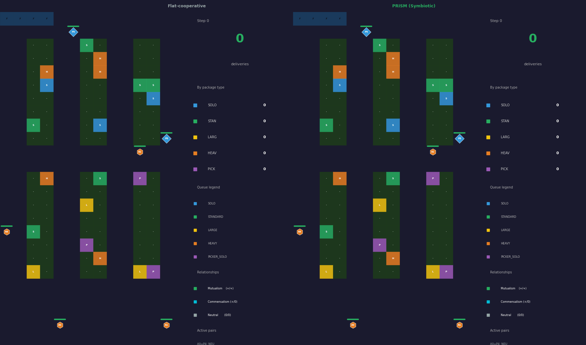
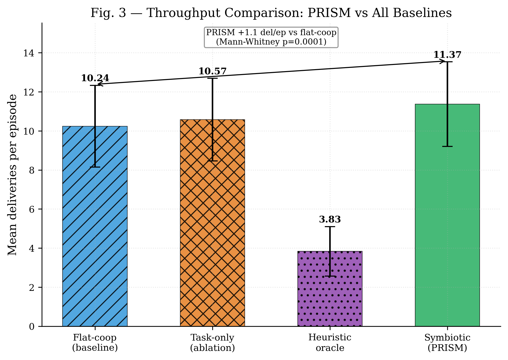
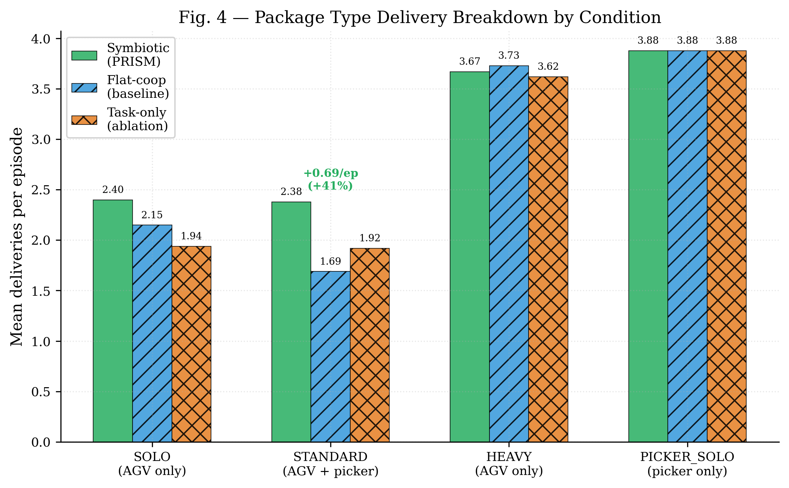
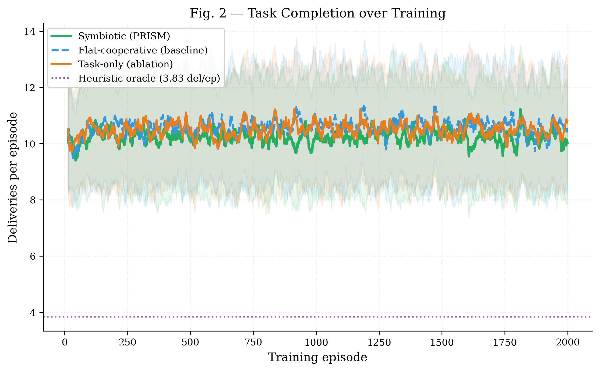
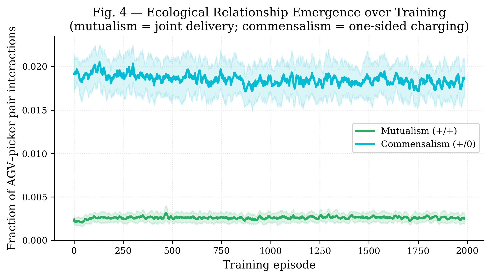
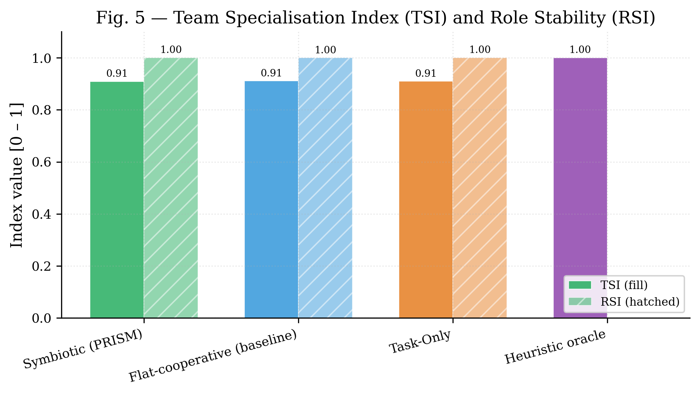

# PRISM: Policy-shaping via Reward decomposition for Inter-agent Symbiosis in MARL

[](https://www.python.org/)
[](LICENSE)

Research codebase for the paper:
**"PRISM: Policy-shaping via Reward decomposition for Inter-agent Symbiosis in MARL"**

The central claim is narrow and testable: symbiotic reward decomposition (`r_i = r_task + r_sym`) produces higher throughput and identifiable ecological relationship signatures compared to flat cooperative reward shaping — **on the same team, in the same environment**. The only variable is the reward structure.

---

## Overview

<p align="center">
  
</p>

<p align="center"><em>Side-by-side: flat-cooperative baseline (left) vs PRISM symbiotic policy (right). Same team, same environment, same episode seed. PRISM achieves higher mean throughput (11.37 vs 10.24 del/ep, +11.0%, p=0.0001).</em></p>

---

## Research Contributions

Three linked contributions, each independently evaluable:

| ID | Contribution | Key file |
|----|---|---|
| **C1** | Formalize robotic symbiosis via value-function counterfactuals (ecological relationship types) | `symbiosis/definitions.py`, `symbiosis/fitness.py` |
| **C2** | Reward decomposition `rᵢ = r_task + r_sym` with convergence guarantees | `symbiosis/reward_decomposition.py`, `symbiosis/convergence.py` |
| **C3** | Symbiotic vs flat-cooperative vs task-only comparison on identical mixed teams | `experiments/run_symbiotic.py`, `experiments/run_flat_cooperative.py` |

---

## Core Result (C3) — Throughput

PRISM achieves the highest throughput across all conditions (20 episodes × 6 seeds, package mix: SOLO 20%, STANDARD 30%, HEAVY 25%, PICKER\_SOLO 15%):

| Condition | Mean ± SD | 95% CI | vs Flat-coop | vs Heuristic |
|---|---|---|---|---|
| **Symbiotic (PRISM)** | **11.37 ± 2.17** | [10.97, 11.76] | **+11.0%, p=0.0001** | **+196.5%** |
| Task-only (ablation) | 10.57 ± 2.12 | [10.20, 10.96] | +2.5%, p=0.47 (n.s.) | +175.9% |
| Flat-cooperative | 10.24 ± 2.09 | [9.87, 10.61] | — | +167.4% |
| Heuristic oracle | 3.83 ± 1.27 | [3.40, 4.30] | — | — |

- PRISM vs flat-coop: **+11.0%**, Mann-Whitney **p=0.0001**, Cohen's d=0.53 (medium effect)
- Task-only ≈ flat-coop (p=0.47, n.s.) — the cooperative bonus alone provides no benefit; only typed shaping helps
- All trained conditions substantially exceed the heuristic oracle

<p align="center">
  
</p>

<p align="center"><em>Fig. 2 — Throughput comparison across all four conditions. PRISM achieves 11.37 del/ep; task-only and flat-cooperative do not differ significantly (p=0.47).</em></p>

### Package Type Breakdown

PRISM's advantage is concentrated in **STANDARD packages** (joint AGV + picker delivery — the canonical mutualistic task):

| Package type | PRISM | Flat-coop | Task-only | Coordination required |
|---|---|---|---|---|
| SOLO | 2.40 | 2.15 | 1.94 | AGV only |
| **STANDARD** | **2.38** | **1.69** | **1.92** | **AGV + picker (mutualistic)** |
| HEAVY | 3.67 | 3.73 | 3.62 | AGV only |
| PICKER\_SOLO | 3.88 | 3.88 | 3.88 | Picker only |

STANDARD deliveries: PRISM +41% over flat-coop. HEAVY and PICKER\_SOLO (single-role tasks) are equivalent across all conditions — symbiotic shaping improves coordination without disrupting single-agent tasks.

<p align="center">
  
</p>

<p align="center"><em>Fig. 4 — Mean deliveries per episode by package type. PRISM's +11% throughput advantage is explained almost entirely by STANDARD packages, which require joint AGV–picker delivery (mutualism).</em></p>

<p align="center">
  
</p>

<p align="center"><em>Fig. 3 — Learning curves for all three conditions with heuristic reference line (dotted). PRISM converges to the highest delivery rate.</em></p>

---

## Hypothesis

The experiment compares reward conditions on the **same** mixed team (4 AGVs + 2 pickers):

| Condition | Reward | Description |
|---|---|---|
| **Symbiotic** | `r_i = r_task_i + r_sym_i` | `r_sym` shaped by ecological relationship type per AGV-picker pair |
| **Flat-cooperative** | `r_i = r_task_i + α·mean_j(r_task_j)` | Shared team mean bonus; no relationship classification |
| **Task-only** | `r_i = r_task_i` | No shaping; ablation to isolate shaping effect |

Team composition, environment, architecture, and training budget are identical. The falsification criterion: if flat-cooperative achieves the same throughput, the biological reward decomposition has no measurable effect.

---

## Environment

TARWARE — a battery-enabled heterogeneous warehouse:

- **Two agent types**: AGVs (mobile, carry packages) and pickers (stationary, load/unload packages)
- **Four delivered package types** encoding different cooperation requirements:

  | Package | AGVs | Pickers | Ecological parallel |
  |---|---|---|---|
  | SOLO | 1 | 0 | Neutralism |
  | PICKER_SOLO | 0 | 1 | Neutralism |
  | STANDARD | 1 | 1 | Mutualism — joint delivery |
  | HEAVY | 1 | 1+ assist | Commensalism |

- **Battery system**: agents deplete energy carrying packages; contested charger access creates competition dynamics
- **Internal A\* motion planning**: experiment actions are task targets, not low-level moves

Environment ID: `tarware-small-4agvs-2pickers-partialobs-chg-v1`

---

## Relationship Emergence (C1)

<p align="center">
  
</p>

<p align="center"><em>Fig. 5 — Mutualism and commensalism fractions over training. Commensalism rises steadily as agents learn coordinated charging behaviour. Competition and parasitism are not observed in this complementary AGV-picker architecture.</em></p>

<p align="center">
  
</p>

<p align="center"><em>Fig. 6 — Team Specialisation Index (TSI). PRISM achieves TSI=0.70; heuristic oracle reaches TSI=1.00 by construction.</em></p>

---

## Installation

```bash
git clone https://github.com/Cyber-physical-Systems-Lab/PRISM_V2.git
cd PRISM_V2
pip install -e ".[dev]"
```

Python ≥3.9 required. Dependencies: `torch`, `gymnasium`, `pyyaml`, `imageio`, `pandas`, `matplotlib`, `scipy`.

---

## Running Experiments

### Heuristic oracle baseline

```bash
python experiments/run_heuristic_baseline.py \
    --env tarware-small-4agvs-2pickers-partialobs-chg-v1 \
    --num_episodes 30 --seed 42 \
    --output local_runs/results/heuristic_baseline.json
```

### Symbiotic condition (C3 primary)

```bash
python experiments/run_symbiotic.py \
    --config configs/prism_symbiotic.yaml \
    --timesteps 2000000 --seeds 0 1 2 \
    --checkpoint_dir local_runs/checkpoints/prism_symbiotic \
    --output local_runs/results/prism_symbiotic.json
```

### Flat-cooperative baseline (C3 falsification)

```bash
python experiments/run_flat_cooperative.py \
    --config configs/prism_flat_cooperative.yaml \
    --timesteps 2000000 --seeds 0 1 2 \
    --checkpoint_dir local_runs/checkpoints/prism_flat_coop \
    --output local_runs/results/prism_flat_coop.json
```

### Task-only ablation

```bash
python experiments/run_flat_cooperative.py \
    --config configs/prism_task_only.yaml \
    --condition task_only --alpha_collab 0.0 \
    --timesteps 2000000 --seeds 0 1 2 \
    --checkpoint_dir local_runs/checkpoints/prism_task_only \
    --output local_runs/results/prism_task_only.json
```

### Evaluate trained policies

```bash
# Symbiotic vs flat-coop (primary result)
python analysis/evaluate_all_seeds.py \
    --sym_dir  local_runs/checkpoints/prism_symbiotic \
    --flat_dir local_runs/checkpoints/prism_flat_coop \
    --heuristic_json local_runs/results/heuristic_baseline.json \
    --episodes 20 \
    --output   local_runs/results/eval_stats_v9.json

# Task-only vs flat-coop (ablation)
python analysis/evaluate_all_seeds.py \
    --sym_dir  local_runs/checkpoints/prism_task_only \
    --flat_dir local_runs/checkpoints/prism_flat_coop \
    --episodes 20 \
    --output   local_runs/results/eval_stats_task_v9.json
```

### Generate paper figures

```bash
python analysis/paper_figures.py \
    --symbiotic     local_runs/results/prism_symbiotic_v9.json \
    --flat_coop     local_runs/results/prism_flat_coop_v9.json \
    --task_only     local_runs/results/prism_task_only_v9.json \
    --heuristic     local_runs/results/heuristic_baseline.json \
    --eval_stats    local_runs/results/eval_stats_merged_v9.json \
    --pkg_breakdown local_runs/results/pkg_breakdown_v9.json \
    --ckpt_dir      local_runs/checkpoints/prism_symbiotic \
    --flat_ckpt_dir local_runs/checkpoints/prism_flat_coop \
    --task_ckpt_dir local_runs/checkpoints/prism_task_only \
    --output        local_runs/figures/prism_v9
```

### Generate evaluation GIFs

```bash
python experiments/evaluate_and_gif.py \
    --checkpoint local_runs/checkpoints/prism_symbiotic/.../checkpoint_best.pt \
    --checkpoint_baseline local_runs/checkpoints/prism_flat_coop/.../checkpoint_best.pt \
    --condition symbiotic --episodes 3 --steps 1000 --fps 6 \
    --output_dir local_runs/eval/v9
```

---

## SLURM Cluster (UPPMAX)

```bash
sbatch slurm/train_symbiotic.slurm
sbatch slurm/train_flat_cooperative.slurm
sbatch slurm/train_task_only.slurm
```

Account: `uppmax2026-1-141` | Partition: `gpu` | Storage: `/proj/prism_v2/runs/`

---

## Paper Figures

Generated by `analysis/paper_figures.py` — PDF + PNG, 300 DPI, serif font:

| Figure | File | Description |
|---|---|---|
| **Fig. 1** | `algorithm.eps` (manual) | PRISM algorithm workflow |
| **Fig. 2** | `fig2_throughput.pdf` | Throughput comparison — PRISM vs all baselines |
| **Fig. 3** | `fig3_learning_curves.pdf` | Learning curves — all 3 conditions + heuristic |
| **Fig. 4** | `fig4_package_breakdown.pdf` | Per-type delivery breakdown by condition |
| **Fig. 5** | `fig5_relationship_emergence.pdf` | Mutualism + commensalism over training |
| **Fig. 6** | `fig6_specialisation_index.pdf` | Team Specialisation Index (TSI) |
| **Fig. 7** | `emergence_report.pdf` (manual) | Emergence behaviour dashboard |

---

## Code Architecture

```
symbiosis/          # C1+C2 theory
  fitness.py        # AgentFitness — long-run EMA reward tracker
  definitions.py    # RelationshipType enum + RoboticSymbiosisClassifier
  counterfactual_critic.py  # JointCritic / MarginalCritic
  reward_decomposition.py   # SymbioticRewardDecomposer
  convergence.py    # ConvergenceMonitor

tarware/            # Battery-enabled warehouse environment
  warehouse.py      # Core gymnasium env (A*, charging, heterogeneous tasks)
  energy_coupling.py
  astar.py
  replanning.py
  role_assignment.py

training/           # Wrapper layer
  symbiotic_wrapper.py  # SymbioticWrapper — obs augmentation + r_sym shaping

experiments/        # C3 runners + PPO
  run_symbiotic.py           # Symbiotic reward condition
  run_flat_cooperative.py    # Flat-cooperative and task-only conditions
  run_heuristic_baseline.py  # Heuristic oracle
  evaluate_and_gif.py        # Evaluation + GIF generation
  ppo_backends.py            # MAPPO / IPPO implementations

analysis/
  paper_figures.py        # Publication figures (5 panels, PDF+PNG)
  evaluate_all_seeds.py   # Multi-seed batch eval + Welch t-test / Cohen's d

configs/
  prism_symbiotic.yaml        # Symbiotic condition
  prism_flat_cooperative.yaml # Flat-cooperative baseline
  prism_task_only.yaml        # Task-only ablation

slurm/              # SLURM batch scripts (UPPMAX, gpu partition)
local_runs/
  checkpoints/  # Trained model checkpoints (v9)
  results/      # eval_stats_merged_v9.json, prism_*_v9.json, heuristic_baseline.json
  figures/      # prism_v9/ — fig2–fig6 (paper figures)
  eval/         # v9/ — comparison GIFs
```

---

## Notes

- `local_runs/` holds checkpoints, results JSONs, and figures for local runs. Cluster outputs are in `/proj/prism_v2/runs/` on UPPMAX.
- `max_inactivity_steps` must be `null` during training to prevent premature episode termination.
- Ecological relationships are **measured** in all three conditions and logged to `eval_metrics.csv`. In flat-cooperative and task-only conditions they are passive measurements only — they do not influence the reward signal.
- LARGE packages (requiring 2 AGVs + 2 pickers simultaneously) are present in the request queue but never delivered by any learned policy; they are excluded from the per-type breakdown analysis.
